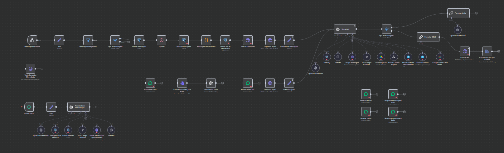
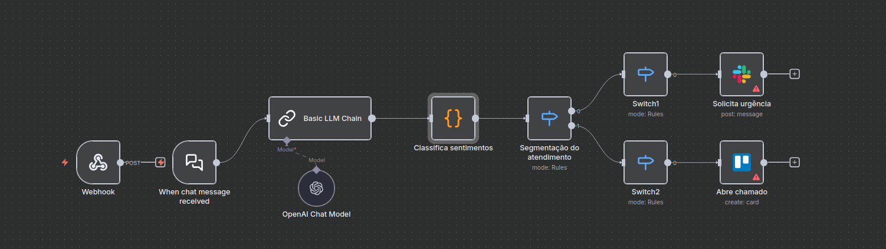

# Automation Workflow Portfolio (n8n)

Welcome! This repository serves as my portfolio of advanced automation workflows, demonstrating skills in n8n, systems integration, and the application of AI and agents.

Each workflow is contained in its own folder, complete with its `.json` file and a detailed `README.md`.

## Workflow Gallery

Here is an overview of the workflows in this portfolio. Click the image or title to see the full details for each one.

| Preview | Workflow | Brief Description | Key Technologies |
| :---: | :--- | :--- | :--- |
|  | **Compliance Validation (Mini-RAG)** | A flow that uses RAG to validate an input JSON against a PDF of business rules. | `n8n` `AI` `Python` `VectorDB` |
|  | **Personal Assistant** | Manages tasks like calendar rescheduling and adding items to a shopping list. | `n8n` `AI` `Google Calendar` `Todoist` |
|  | **AI Secretary (Healthcare)** | Schedules appointments for doctors, responding via audio and text on WhatsApp. | `n8n` `AI` `PostgreSQl` |
|  | **Intelligent Support Triage** | Monitors a channel and uses AI to classify, prioritize, and route support tickets. | `n8n` `AI` `JS` |

---

### How to Use
To import any of these workflows into your n8n instance:

1.  Navigate to the desired workflow's folder (e.g., `/rag-validation/`).
2.  Download the `.json` file (e.g., `workflow-rag.json`).
3.  In your n8n instance, go to **Import** > **From File** and select the `.json` file.
4.  Configure the necessary credentials (APIs, databases, etc.).
