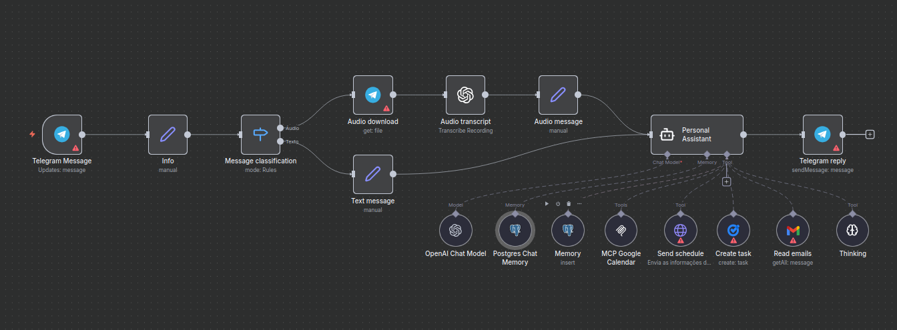

# 🎧 Workflow: Intelligent Support Triage (with Escalation)

This workflow automates support ticket triage, focusing on identifying and urgently escalating the most critical cases. It uses AI to analyze ticket sentiment and category, treating angry customers with technical issues as the highest priority.

---

### Objective

To reduce response time for critical cases and decrease customer churn. The goal is to use AI to identify "negative" sentiment on "technical" issues and *immediately* escalate them to a human agent via Slack, while all standard tickets follow the normal flow into Trello.

---

### How It Works

1.  **Trigger (Email or Webhook):** The flow starts via `Webhook` or `Email` when a new ticket is opened.
2.  **AI Agent (Classifier):** The ticket's content is sent to an AI Agent (LLM). The prompt asks the AI to return a structured JSON object containing:
    * `category`: (e.g., "Technical," "Billing," "General Question")
    * `sentiment`: (e.g., "Negative," "Neutral," "Positive")
3.  **Escalation Logic (IF Node):** An `IF` node checks the AI's output.
    * **Condition:** `If category == "Technical" AND sentiment == "Negative"`
4.  **Path A (Urgent):** If the condition is TRUE, the flow sends a `Slack` message to the `@urgent-support` channel with the ticket details, tagging `@here` and requesting immediate human attention.
5.  **Path B (Standard):** If the condition is FALSE (for all other cases), the flow creates a card on the "New Tickets" board in `Trello` to be handled in the standard queue.
6.  **Auto-Reply:** (Optional) An email is sent to the customer confirming receipt.

---

### Key Components

* **Webhook / Email Node:** The entrypoint for tickets.
* **AI Agent (LLM):** The brain that analyzes sentiment and category.
* **IF Node:** The logic component that decides the ticket's route (Urgent vs. Standard).