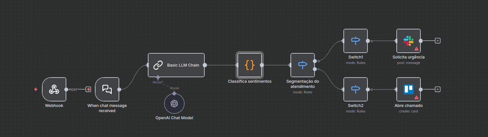

# 🧑‍⚕️ Workflow: Personal Assistant (for Doctors)

This workflow acts as an internal personal assistant for doctors, accessible 24/7 via a private Telegram bot. It is designed to process natural language to execute practice management and personal tasks.

---

### Objective

To maximize the efficiency of busy doctors by allowing them to manage their professional schedule (patient rescheduling) and personal tasks (shopping list) quickly, from anywhere, using only voice or text commands in Telegram.

---

### How It Works

1.  **Trigger (Telegram Bot):** The flow starts when the doctor sends a message (text or audio) to a private Telegram bot. *If audio, an STT node transcribes it.*
2.  **AI Agent (Router):** The text command is sent to an AI Agent (LLM). The prompt instructs the AI to identify the *intent* (e.g., "reschedule_appointment," "add_shopping") and *extract entities*.
    * Ex 1: "Reschedule patient Carlos Silva to Tuesday at 10 AM" -> `{"intent": "reschedule_appointment", "patient": "Carlos Silva", "new_date": "next Tuesday 10:00"}`
    * Ex 2: "Add milk and coffee to the shopping list" -> `{"intent": "add_shopping", "items": ["milk", "coffee"]}`
3.  **Router (Switch):** An n8n `Switch` node reads the "intent" returned by the AI and directs the flow down the correct path.
4.  **Path 1 (Shopping List):** If the intent is "add_shopping," the flow uses an app node (e.g., `Todoist`, `Google Tasks`) to add the items to the doctor's "Groceries" list.
5.  **Path 2 (Calendar):** If the intent is "reschedule_appointment," the flow uses the `Google Calendar` node to first *find* the appointment (e.g., "Patient Carlos Silva") and then *update* it to the new date/time.
6.  **Confirmation:** The flow sends a confirmation message back to the doctor via `Telegram` (e.g., "Carlos Silva's appointment successfully rescheduled to Tuesday at 10 AM.").

---

### Key Components

* **Telegram Trigger:** The secure and private entrypoint for the doctor.
* **AI Agent (LLM):** Essential for understanding natural language, classifying intent, and extracting data from the doctor's speech.
* **Google Calendar Node:** Manages the patient schedule.
* **Google Tasks Node:** Manages personal to-do lists.
* **Telegram Sender:** Sends the action confirmation back to the doctor.

---

### 🚀 How to Test

1.  Import the `personal-assistant.json` file into n8n and configure credentials (Telegram Bot Token, AI, Google).
2.  Open your Telegram app and send a message to your bot: "Add tomatoes and bread to my shopping list."
3.  Check your to-do list app (Todoist, etc.) to see if the items appeared.
4.  Send another message: "Reschedule my patient 'Ana Souza' to Friday at 2 PM."
5.  Check your Google Calendar to see if the appointment was moved and if you received a confirmation in Telegram.
